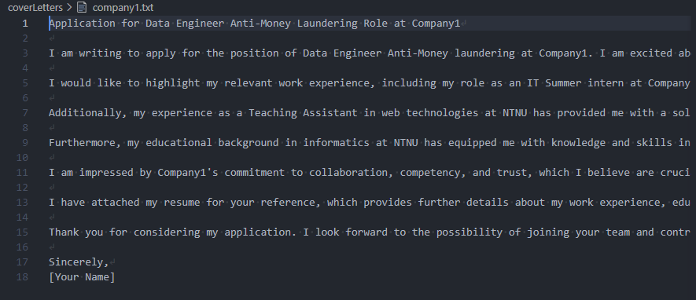

# About the application

It is a problem that students often have to write and personalize a lot of cover letters when they are looking for summer internships. This can be a very time consuming task which may in large affect their academic performance. This project aims to automate the process of writing these cover letters. The cover letters are generated by sending the job advertisement and the users resume to the openai API, and then using the API's text generation feature to generate the cover letters. The cover letters are saved to a file which the users easily can modify to their liking before sending them to the companies they are applying to.



# Set up the project

The project requires that you have the openai python package installed. You can install it by running the following command:

```bash
pip install --upgrade openai
```

You may also need the dotenv package. You can install it by running the following command:

```bash
pip install python-dotenv
```

To make this project work you have to go to https://platform.openai.com/api-keys and get an API key. The API key should be placed in a .env file in the root of the project. The .env file should then look like this:

```bash
OPENAI_API_KEY=your_api_key
```

If you have never used the openai API before, you may recieve 18$ worth of credits for free. You will have to pay for more tokens if these free credits have been used up or have expired. You can read more about their pricing here: https://openai.com/pricing/

The cost of a single cover letter is about 0.004$ with the default model depending on the size of your resume and the size of the job advertisement. This means that you can generate about 4500 cover letters with the free credits.

You can experiment with different AI models, however the default model for this application is the **gpt-3.5-turbo** model as it is the most cost effective model (in other words: its best suited for the student economy). You can change the AI model by changing the "model" variable in the main python file.

# How to use the application

To run the application, run the following command in the root of the project:

```bash
python main.py
```

The "jobAds" folder is supposed to contain the job advertisements as .txt-files which the program will use to generate the cover letters. The program will generate one cover letter for each .txt-file in this folder.

The "coverLetters" folder contains the generated cover letters after the program has finished running.

The "resume.txt" file should contain the resume of the user. The program will use this information to generate the cover letters personalized for the user.

You can modify the "rules" and "content" variables in the main python file to your liking to adjust how the cover letters are generated.

Made with ❤️ (and some annoyance) by [Frederik Farstad](https://github.com/frederikfarstad)
